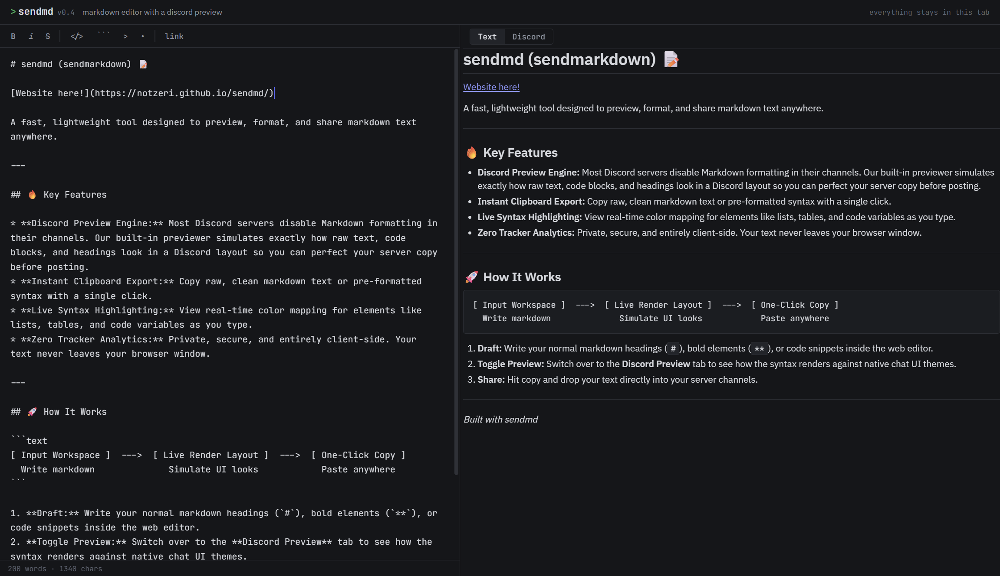

# sendmd (sendmarkdown) 📝

## **[Website here!](https://notzeri.github.io/sendmd/)**

A fast, lightweight tool designed to preview, format, and share markdown text anywhere. 

---

## 🔥 Key Features

* **Discord Preview Engine:** Most Discord servers disable Markdown formatting in their channels. Our built-in previewer simulates exactly how raw text, code blocks, and headings look in a Discord layout so you can perfect your server copy before posting.
* **Instant Clipboard Export:** Copy raw, clean markdown text or pre-formatted syntax with a single click.
* **Live Syntax Highlighting:** View real-time color mapping for elements like lists, tables, and code variables as you type.
* **Zero Tracker Analytics:** Private, secure, and entirely client-side. Your text never leaves your browser window.



---

## 🚀 How It Works

```text
[ Input Workspace ]  --->  [ Live Render Layout ]  --->  [ One-Click Copy ]
  Write markdown              Simulate UI looks            Paste anywhere
```

1. **Draft:** Write your normal markdown headings (`#`), bold elements (`**`), or code snippets inside the web editor.
2. **Toggle Preview:** Switch over to the **Discord Preview** tab to see how the syntax renders against native chat UI themes.
3. **Share:** Hit copy and drop your text directly into your server channels.

---

*Built with sendmd*
